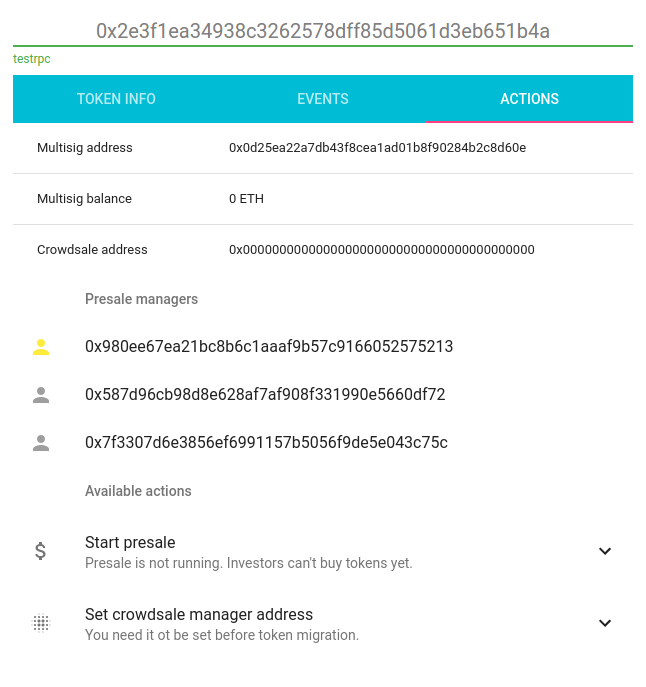
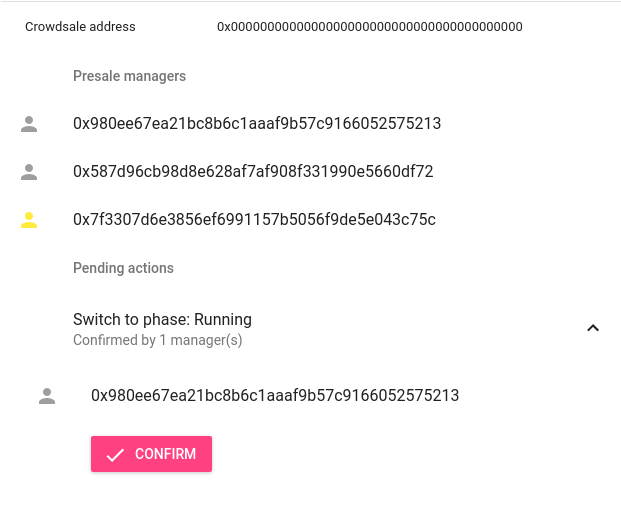
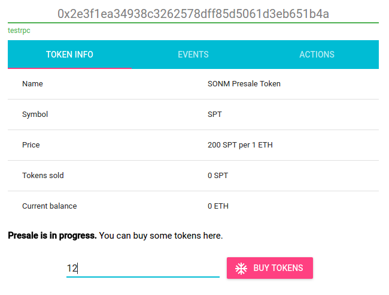

Our Contract Development Approach
=================================
We like open shared and reusable smart contracts, so we searched and 
evaluated available code as we set out to create token and sale contracts.

We started with the intention of using the OpenZeppelin library but noticed 
differences between the master branch on GitHub, and the package suggested 
in the Truffle framework tutorial:

```
$ npm install zeppelin-solidity
```

As the zeppelin development roadmap is ongoing, released code does not 
include all the functionality we wanted. Existing code also includes 
some implementation details we wanted to adjust:
1) token lifecycle needs robustness beyond pause (see SONM PresaleToken phases).
2) token lifecycle extends beyond that of crowdsale lifecycle (ex: migration).
3) token should not be embeded in crowdsale contract.
4) token deployment should not assume deployer is owner (crowdsale manager).
5) crowdsale manager should be a multisigwallet (Crowdsale.sol is not).
6) Crowdsale.sol implements token functions (buyTokens, burnTokens, forwardFunds)
7) Crowdsale.sol lacks mechanism for discounted token purchase rate.

Similarly, we like the SONM approach but it also is work-in-progress and missing:
1) refunding phase
2) finalized phase
3) refund vault
4) refund claim
5) token destruction

Both code bases are also are missing token migration/conversion functions.

We combined features from both to create our token sale smart contracts.


Token Contracts
===============

During its lifetime, a token contract passes through several *phases*.
Each phase determines which functions can be called on the contract. 
Token managers (MultiSigWallet owners) are able to switch phases according 
to rules described below.

A Token may be migrated/converted into a new token with or without a new 
crowdsale. This migration is managed using a MigrationManager contract. We 
think SONM calls it CrowdsaleManager instead, and refers to TokenManager as
the zeppelin crowdsale manager (token owner in zeppelin). In our view, 
a CrowdsaleManager/MigrationManager is a successor token that can convert,
migrate, or upgrade earlier tokens to new/current tokens.

Switching phases and calling administrative functions is possible only by
joint decision of token managers defined as owners in the MultiSigWallet.

Most functions are implemented in a derived contract named: RefundableToken.
This contract is a hybrid of SONM Presale token and zeppelin contracts with 
some modifications.

Simplified crowdsale administration functions are implemented in a contract 
named: ICOTokenManager. This contract is essentially the SONM presale TokenManager 
with additional functions for managing the additional features in our token 
not availabe in the SONM presale token (ex: vested tokens and destroy).

Bounty contract creation and funding will be developed post successful fundraising.


Token Lifecycle Phases
----------------------

There are eight states (or phases):
  - **Created**. Contract is created but investors are not able to buy 
    tokens just yet.
  - **Running**. Investors can buy tokens (until sale ends or cap limit 
    is reached). Token managers are able to temporarily pause the sale 
    or switch to finalizing phase. Presale investors can and must migrate/
    convert earlier sale (or presale) tokens to current (or ICO) tokens. 
    Token managers can pause the current sale.
  - **Paused**. Investors can't buy tokens. Previous sale investors cannot 
    convert previous sale tokens to current tokens. Token managers can 
    resume the sale or switch to finalizing phase. 
  - **Finalizing**. Investors can't buy tokens. Current sale has finished. 
    Previous sale investors can convert previous tokens to current tokens.
    If sale goal is reached, contract automatically switches to Finalized 
    phase. Otherwise, contract automatically switches to Refunding phase.
  - **Finalized**. Investors can't buy tokens. Previous sale investors 
    cannot convert previous sale tokens to current tokens. Token managers 
    can switch to migration phase if token contract is to be upgraded.
    *Token transfers are allowed only in this phase*.
  - **Refunding**. Investors can't buy tokens. Previous sale investors 
    cannot convert previous sale tokens to current tokens. Token managers 
    can switch to migrating phase if token contract is to be upgraded.
    Investors can claim refunds.
  - **Migrating**. Investors can't buy tokens but can convert their sale 
    tokens to an upgraded token announced by token managers.
  - **Migrated**. Current contract automatically switches to this phase 
    when all tokes are successfully upgraded or when forced by token managers.


Management Functions
--------------------

  - `tokenSetPhase`. Allows to switch sale phases. Only specific
    phase transitions that comply to this state diagram are allowed:


```
                  +-----------+
                  |           |
               +-->  Running  +---------+
               |  |           |         |
+-----------+  |  +--+----^---+  +------v-------+     /-------\    +------------+
|           |  |     |    |      |              |    /         \   |            |
|  Created  +--+     |    |      |  Finalizing  +---> Goal Met? +-->  Refunding |
|           |        |    |      |              |    \         /   |            |
+-----------+        |    |      +------^-------+     \---+---/    +-----+------+
                  +--v----+---+         |                 |              |
                  |           |         |          +------v------+       |
                  |  Paused   +---------+          |             |       |
                  |           |                    |  Finalized  <-------+
                  +-----------+                    |             |
                                                   +------+------+
                                                          |
                                 +-------------+    +-----v-----+
                                 |             |    |           |
                                 |  Migrated   <----+ Migrating |
                                 |             |    |           |
                                 +-------------+    +-----------+

```

  - `tokenSetMigrationManager`. This function allows to set migration manager
    contract address. Migration manager is responsible for migrating previous 
    sale tokens and has exclusive rights to burn previous sale tokens after 
    migration is complete. Valid migration manager address is required to 
    switch to *Migrating* phase. It is not possible to change migration manager 
    address when migration is in progress.

  - `tokenGrantVestedTokens`. This function is used to grant tokens on a 
    vesting schedule. The function can be called only at the Finalized phase.
    
  - `tokenRevokeTokenGrant`. This function is used to revoke granted tokens.
    The function can be called only at the Finalized phase.
    
  - `tokenDestroy`. This function is used to destroy the token contract.
    The function can be called only at any phase.
    

Contracts
---------
There are two contracts involved in a sale process:

  - `RefundableToken`: holds registry of investors and their token balances,
    also acts as a temporary storage for gathered ETH.
  - `ICOTokenManager`:  standard multisig wallet with extra functions 
    to control the sale process.

For testing purposes those contracts are deployed on test networks:

  - Rinkeby: Fri 08 Dec 2017 01:29:10 PM EST 
    - ICOTokenManager: 0x6ed9ae994486192c240da724665c45be469c5eb0
      - "blockHash": "0xa6645235e24ade49bb68810e0c0e98b24be5b2686db99bd24a96146e799dc0e3",
      - "blockNumber": "0x150d78",
      - "status": "0x1",
      - "transactionHash": "0x47f423f234df2ff2cee087bc1f1076b49b50bbd8b9fb6fa17de7d9df0200ad3b",

    - RefundableToken: 0x8ade43388d04946ae635f9699f2353cf320e4ae2
      - "blockHash": "0xb90f7b6c18d415a3dcbd2b063f8f9ff24d9526d810c2007b6a26d3214d5855cb",
      - "blockNumber": "0x150d7a",
      - "status": "0x1",
      - "transactionHash": "0x7953c315cf96ee11c1c875d88a7d9dbe2f4ed2a310e410429af17c8adb340810",

Reference Contract Sources
--------------------------
Token and Sale Manager contracts adapted from the [SONM project](https://github.com/sonm-io/presale-token.git)
and from the [OpenZeppelin project](https://github.com/OpenZeppelin/zeppelin-solidity)

Token Manager is an implementation of the [Gnosis multisig wallet](https://github.com/gnosis/MultiSigWallet)
also see the blog [Release of new Multisig Wallet](https://blog.gnosis.pm/release-of-new-multisig-wallet-59b6811f7edc)
it is used to collectively manage ETH funds and allows withdrawals,
adding/removing owners, and sending custom transactions. There is web-based UI
to interact with it: https://wallet.gnosis.pm.

The deployed `ICOTokenManager` contracts are configured each with 3 manager
addresses and require 2 confirmations to run transactions:

  - Manager addresses on Rinkeby
    -  [0x47cD92b0824E06ACCd9805bebEB89b676beDB79F](https://rinkeby.etherscan.io/address/0x47cD92b0824E06ACCd9805bebEB89b676beDB79F)
    - [0x6b385cE594d12d4C4EfD5e19FF34c8eabb78d531](https://rinkeby.etherscan.io/address/0x6b385cE594d12d4C4EfD5e19FF34c8eabb78d531)
    - [0xAfc411ab664F9c38044510D9fd40F62E79460594](https://rinkeby.etherscan.io/address/0xAfc411ab664F9c38044510D9fd40F62E79460594)

All those addresses are preloaded with some ether for testing purposes.


Sale Administration
-------------------

`ICOTokenManager` contract adds three new functions to the multisig. Those
functions allow to withdraw ETH funds from the `RefundableToken`, switch 
ICO sale phase, and set crowdsale/migration contract address. There is 
web-based UI to simplify executing administrative functions: 
https://github.com/vectavi/vmt. In the following we will see how to use it.

By default, `RefundableToken` contract does not allow to buy tokens. token 
manager team can enable buying by switching `RefundableToken` to "Running" phase.

On the "Actions" tab you can see "Available actions" section. (If this is not
the case, select registered multisig account in your Web3 provider and refresh).



Press "Start Presale" button, confirm transaction, then wait for the
transaction to be mined, and refresh the page (if required). Now you will see
new action in "Pending actions" section.

Anoter member of the team can see pending action and confirm it.



After two confirmations the action will be executed and token buying will be
enabled. You can switch to "Token Info" and see "Buy tokens" button.



Other actions like pause / resume / withdraw can be executed in the same way.

